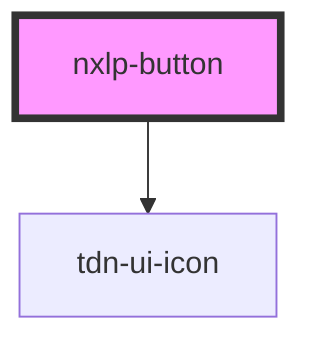

# nxlp-button

<!-- Auto Generated Below -->

## Properties

| Property | Attribute | Description | Type                                                     | Default           |
| -------- | --------- | ----------- | -------------------------------------------------------- | ----------------- |
| `icon`   | `icon`    |             | `string`                                                 | `undefined`       |
| `text`   | `text`    |             | `string`                                                 | `undefined`       |
| `type`   | `type`    |             | `BtnType.Danger \| BtnType.Primary \| BtnType.Secondary` | `BtnType.Primary` |

## Dependencies

### Depends on

- [tdn-ui-icon](../icon)

### Graph

----------------------------------------------

*Built with [StencilJS](https://stenciljs.com/)*
