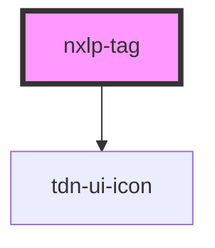

# nxlp-tag

<!-- Auto Generated Below -->

## Properties

| Property   | Attribute  | Description | Type                                                                                      | Default     |
| ---------- | ---------- | ----------- | ----------------------------------------------------------------------------------------- | ----------- |
| `category` | `category` |             | `TagCategory.Family \| TagCategory.Important \| TagCategory.Personal \| TagCategory.Work` | `undefined` |
| `edit`     | `edit`     |             | `boolean`                                                                                 | `undefined` |

## Dependencies

### Depends on

- [tdn-ui-icon](../icon)

### Graph

----------------------------------------------

*Built with [StencilJS](https://stenciljs.com/)*
